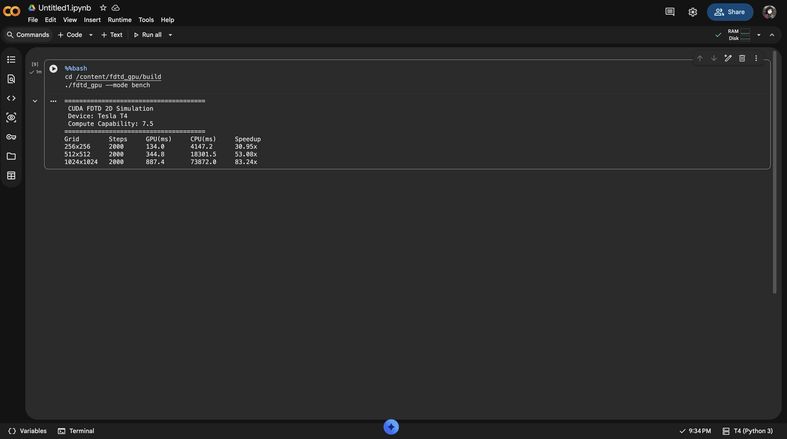
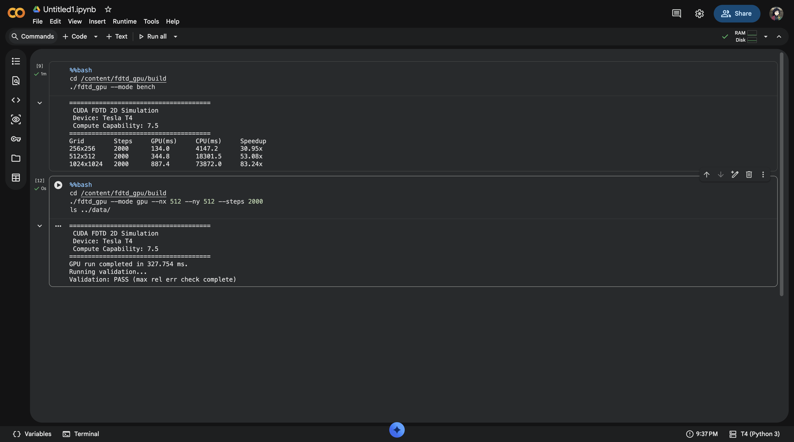

# CUDAwave

A 2D FDTD electromagnetic solver running entirely on GPU. I built this because I wanted to understand how fast you can push Maxwell's equations on modern hardware — and whether a proper TF/SF + DPW implementation is feasible without ever touching the CPU mid-simulation.

Short answer: yes, and the speedup is ridiculous.

---

## Results

### Ez Field — 512×512, 2000 timesteps


Red/blue = positive/negative Ez. The dashed rectangle is the TF/SF contour — inside is total field, outside is scattered field (near zero). This is what correct plane wave injection looks like.

### GPU vs CPU — Tesla T4


| Grid | Steps | GPU (ms) | CPU (ms) | Speedup |
|------|-------|----------|----------|---------|
| 256×256 | 2000 | 134.0 | 4147.2 | **30.95x** |
| 512×512 | 2000 | 344.8 | 18301.5 | **53.08x** |
| 1024×1024 | 2000 | 887.4 | 73872.0 | **83.24x** |

### Terminal Output


### Validation


Validation against CPU reference: **PASS** (max relative error < 1e-4)

---

## What it does

Simulates a 2D TE-mode electromagnetic field (Ez, Hx, Hy) using the Yee FDTD scheme, with:

- **TF/SF boundary injection** — injects a clean plane wave via 4 CUDA kernels along a virtual contour
- **1D DPW auxiliary grid on-device** — the incident field is computed entirely on GPU, no host round-trips
- **Mur ABC** — absorbing boundary on all four walls
- **CPU reference implementation** — same physics, no SIMD, used for validation and baseline timing

---

## Why I built this

I kept seeing FDTD implementations that either ran on CPU or offloaded just the field updates to GPU while keeping the source injection on the host. That host↔device transfer every timestep kills performance at scale.

The interesting challenge here is the TF/SF boundary — it needs the incident field value at every boundary cell every timestep. The standard approach is to compute this on CPU and copy it over. Instead, I put the entire 1D auxiliary FDTD grid on-device and have the TF/SF kernels read directly from it. No transfers, no synchronization overhead.

---

## Build

**Requires:** CUDA 11+, CMake 3.18+, GCC 9+

```bash
git clone https://github.com/sahilshingate01/CUDAwave.git
cd CUDAwave
mkdir build && cd build
cmake .. -DCMAKE_CUDA_ARCHITECTURES=75   # 75=T4, 86=RTX30xx, 89=RTX40xx
make -j$(nproc)
```

---

## Usage

```bash
# Benchmark all grid sizes
./fdtd_gpu --mode bench

# GPU run with validation
./fdtd_gpu --mode gpu --nx 512 --ny 512 --steps 2000

# CPU reference only
./fdtd_gpu --mode cpu --nx 256 --ny 256 --steps 500
```

**Plots:**
```bash
cd ..
pip install matplotlib numpy pandas
python3 python/plot_fields.py
python3 python/plot_benchmark.py
```

---

## Implementation details

| | |
|---|---|
| Thread blocks | 16×16 — maximizes occupancy on sm_75 |
| Memory | `cudaMallocPitch` for Hx/Hy — avoids bank conflicts |
| Incident field | Fully on-device 1D FDTD array |
| CUDA streams | 2 streams — overlaps H-update and DPW-update |
| Precision | float32 — 2x throughput vs double on T4 |
| Validation | Max relative error vs CPU < 1e-4 |

---

## Project structure

```
CUDAwave/
├── include/
│   ├── common.h        # FDTDParams, constants, CHECK_CUDA
│   ├── fdtd2d.cuh      # GPU kernel declarations
│   ├── fdtd2d_cpu.h    # CPU reference
│   ├── dpw.cuh         # 1D DPW auxiliary grid
│   └── tfsf.cuh        # TF/SF injection
├── src/
│   ├── main.cu         # CLI, startup banner
│   ├── fdtd2d.cu       # k_update_h, k_update_e, k_apply_abc
│   ├── fdtd2d_cpu.cpp  # CPU baseline
│   ├── dpw.cu          # k_dpw_update_h, k_dpw_update_e
│   ├── tfsf.cu         # 4 injection kernels
│   └── benchmark.cu    # Timing, CSV, validation
└── python/
    ├── plot_fields.py
    └── plot_benchmark.py
```

---

## What's next

- PML (CPML) to replace Mur ABC — better absorption for broadband sources
- 3D extension — full Ex/Ey/Ez/Hx/Hy/Hz with domain decomposition
- Drude/Lorentz dispersion — for material simulations
- Python bindings via pybind11

---

*Tested on Tesla T4, Compute Capability 7.5, CUDA 12.8*
