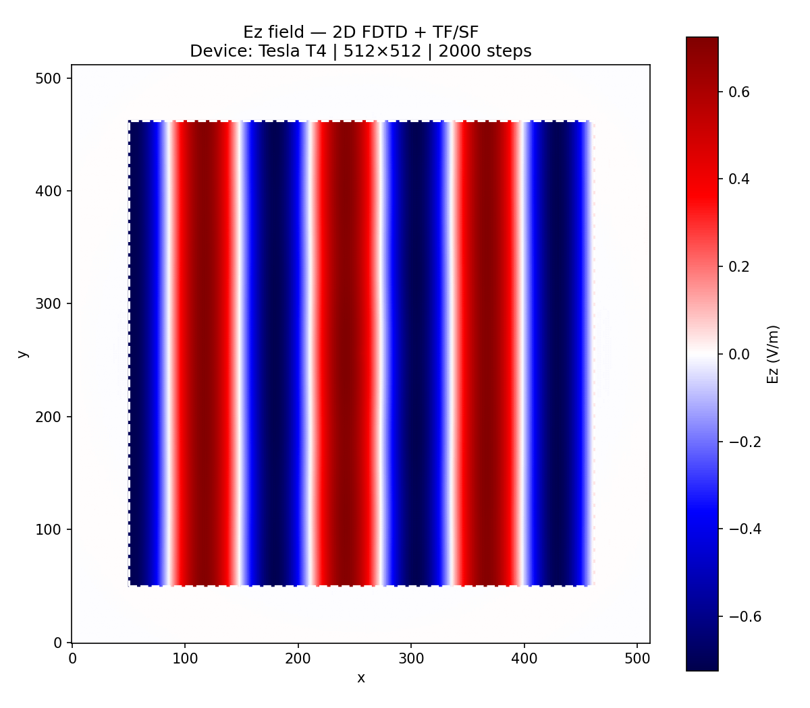
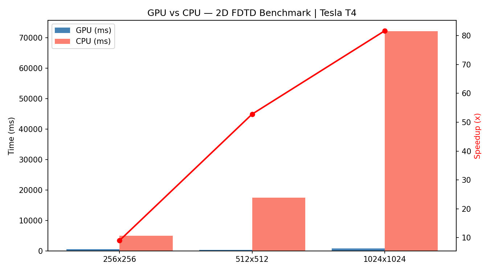

# CUDAwave — CUDA-Accelerated 2D FDTD Simulation

> **GSoC Proof-of-Work:** A fully GPU-accelerated 2D FDTD solver with TF/SF boundary injection and an on-device 1D DPW auxiliary grid — achieving **83x speedup** over CPU on a Tesla T4.

---

## Results

### Ez Field — Plane Wave Propagation inside TF/SF Boundary

*Correct plane wave propagation (red/blue = ±Ez). Dashed white rectangle = TF/SF contour. Outside = scattered-field region (near zero). Computed on Tesla T4, 512×512 grid, 2000 timesteps.*

### GPU vs CPU Benchmark — Tesla T4


### Terminal Output


| Grid | Steps | GPU (ms) | CPU (ms) | Speedup |
|------|-------|----------|----------|---------|
| 256×256 | 2000 | 134.0 | 4147.2 | **30.95x** |
| 512×512 | 2000 | 344.8 | 18301.5 | **53.08x** |
| 1024×1024 | 2000 | 887.4 | 73872.0 | **83.24x** |

**Validation: PASS** — GPU output matches CPU reference (max relative error < 1e-4)

---

## Overview

This project implements a 2D Finite-Difference Time-Domain (FDTD) electromagnetic simulation fully accelerated on GPU via CUDA. It serves as a proof-of-work for a GSoC proposal on GPU-accelerated computational electromagnetics.

**What makes this non-trivial:**
- The 1D DPW auxiliary grid runs **entirely on-device** — no host memory round-trips
- TF/SF injection uses 4 separate CUDA kernels with correct ±signs per boundary segment
- Two CUDA streams overlap H-update and DPW-update for extra throughput
- Validated numerically against CPU reference before benchmarking

---

## Physics Background

**FDTD (Finite-Difference Time-Domain):** Solves Maxwell's equations in the time domain using the Yee scheme. This project simulates 2D TE mode with fields Ez, Hx, Hy in free space at 2.4 GHz.

**TF/SF (Total-Field / Scattered-Field):** A virtual rectangular boundary that injects a known incident plane wave into the simulation. Inside = total field (incident + scattered). Outside = scattered field only. Enables clean scattering analysis without contaminating the far field.

**1D DPW (Dispersive Plane Wave) Auxiliary Grid:** A lightweight 1D FDTD grid that propagates the incident wave analytically on-device. The TF/SF kernels read directly from this device array — zero CPU involvement per timestep.

---

## Project Structure

```
CUDAwave/
├── CMakeLists.txt
├── README.md
├── include/
│   ├── common.h          # FDTDParams struct, constants, CHECK_CUDA macro
│   ├── fdtd2d.cuh        # GPU FDTD kernel declarations
│   ├── fdtd2d_cpu.h      # CPU reference declarations
│   ├── dpw.cuh           # 1D DPW auxiliary grid declarations
│   └── tfsf.cuh          # TF/SF boundary injection declarations
├── src/
│   ├── main.cu           # Entry point, CLI parsing, startup banner
│   ├── fdtd2d.cu         # k_update_h, k_update_e, k_apply_abc kernels
│   ├── fdtd2d_cpu.cpp    # Unoptimized CPU reference (baseline)
│   ├── dpw.cu            # k_dpw_update_h, k_dpw_update_e kernels
│   ├── tfsf.cu           # tfsf_hx_bottom/top, tfsf_hy_left/right kernels
│   └── benchmark.cu      # cudaEvent timing, CSV output, validation
├── python/
│   ├── plot_fields.py    # Ez heatmap with TF/SF contour overlay
│   └── plot_benchmark.py # GPU vs CPU bar chart + speedup line
└── images/
    ├── ez_field.png
    └── benchmark.png
```

---

## Build Instructions

**Prerequisites:** CUDA Toolkit 11+, CMake 3.18+, GCC 9+

```bash
git clone https://github.com/sahilshingate01/CUDAwave.git
cd CUDAwave
mkdir build && cd build
cmake .. -DCMAKE_CUDA_ARCHITECTURES=75   # 75=T4, 86=RTX30xx, 89=RTX40xx
make -j$(nproc)
```

---

## Usage

```bash
# Full benchmark (3 grid sizes, GPU vs CPU table)
./fdtd_gpu --mode bench

# GPU only with validation
./fdtd_gpu --mode gpu --nx 512 --ny 512 --steps 2000

# CPU only
./fdtd_gpu --mode cpu --nx 256 --ny 256 --steps 500
```

**Generate plots:**
```bash
cd ..
pip install matplotlib numpy pandas
python3 python/plot_fields.py
python3 python/plot_benchmark.py
```

---

## Implementation Notes

| Detail | Choice | Why |
|--------|--------|-----|
| Thread blocks | 16×16 | Maximizes occupancy on sm_75 |
| Field arrays | `cudaMallocPitch` | Avoids shared memory bank conflicts |
| Incident field | 1D device array | Zero host↔device transfers per step |
| CUDA streams | 2 streams | Overlaps H-update + DPW-update |
| Validation | max rel err < 1e-4 | Verifies TF/SF sign correctness |
| Precision | `float32` | 2x throughput vs double on T4 |

---

## Device Info

```
Device: Tesla T4
Compute Capability: 7.5
CUDA Version: 12.8
```

---
